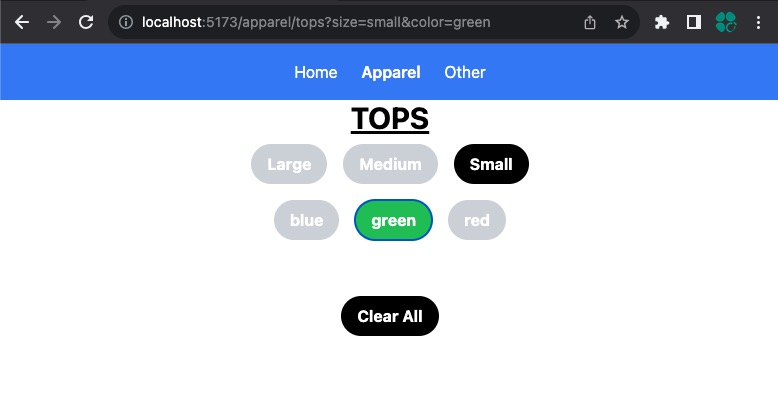

# React App using Query String for state management

## Benefits?
keeping this state in url has many benefits
- User can bookmark and share the URL and get the same state of the application
- User can use the back/forward history from the browser buttons
- User can pass in parameters changed in the URL
- Search engine optimization - URLs with structured state data can improve search engine ranking

